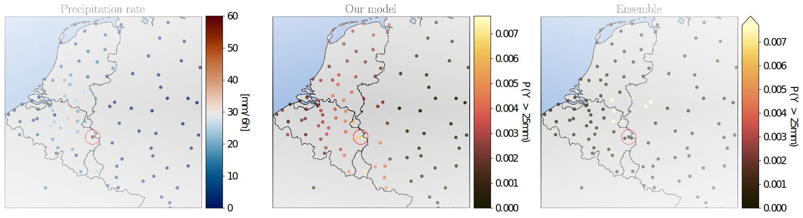

# GNN Post-Processing for Precipitation Forecasting

> **Paper Reference**:  
> **GRAPH NEURAL NETWORKS FOR ENHANCING ENSEMBLE FORECASTS OF EXTREME RAINFALL**  
> *Christopher Bülte, Sohir Maskey, Philipp Scholl, Jonas von Berg, Gitta Kutyniok*  
> Published as a workshop paper at “Tackling Climate Change with Machine Learning”, ICLR 2025

## Table of Contents

1. [Introduction](#introduction)
2. [Installation & Environment](#installation--environment)
3. [Single-Run Training](#single-run-training)
4. [Single-Run Evaluation](#single-run-evaluation)
5. [Batch Experiments via Bash](#batch-experiments-via-bash)
6. [Where to Find Results](#where-to-find-results)
7. [License](#license)

---

## Introduction

In [our workshop paper](#references) “Graph Neural Networks for Enhancing Ensemble Forecasts of Extreme Rainfall,” we present a novel **graph neural network** (GNN) approach to post-process ensemble forecasts of precipitation. Our focus is on capturing both:

- **Zero-precipitation** events (via a discrete point mass), and  
- **Heavy-tail extremes** (via a generalized Pareto distribution).  

This addresses challenges arising from **climate-change-driven** extreme rain events, which standard ensemble forecasts (e.g., from ECMWF) often fail to capture. By building station-based graphs and learning **spatial dependencies**, we demonstrate improved calibration and skill for heavy rainfall across multiple lead times.

**Key Features**:

- **Mixture distribution** combining a discrete mass at zero with a tail-modeled GPD.  
- **DeepSets** to handle ensemble permutations.  
- **GINE** (Graph Isomorphism Network with Edge features) to embed station-level data and distances.  
- **CRPS** training for a fully probabilistic forecast distribution.

If you're **interested in** robust, accurate precipitation forecasting with neural networks – especially in the context of extreme events – this code can serve as a reference or baseline for further research.

We show that this method better captures **rare, high-rainfall events** than standard ensemble post-processing methods – a crucial improvement under climate-change-driven extremes.

This figure highlights how our GNN approach assigns higher probabilities to **heavy-rain** scenarios compared to conventional ensemble forecasts.

<center>

</center>


## Installation

1. **Clone** this repository:
   ```
   git clone https://github.com/username/gnn-postprocessing.git
   cd gnn-postprocessing
   ```
2. **Install** conda.

3. **Create** environment.
   ```
   conda env create -f environment.yml
   conda activate gnn-env
   ```
   
## Environment Setup

The environment.yml file defines a conda environment named gnn-env with:

    - Python 3.9

    - PyTorch 2.0.1 (compatible with CUDA 11.8)

    - PyTorch Geometric (2.3.1+)

    - Other libraries: NumPy, pandas, scikit-learn, geopy, etc.

Install and activate:
   ```
   conda env create -f environment.yml
   conda activate gnn-env
   ```
    

## Single-Run Training

You can do a single run (for example, 24-hour lead time, mixed config) by specifying:
    
    
    python train.py \
    --leadtime 24h \
    --dir trained_models/24h_mixed_u \
    --run_id 0
    
    
What happens:

- train.py looks for params.json in trained_models/24h_mixed_u/ (make sure it exists).

- Creates logs in trained_models/24h_mixed_u/train_0.log.

- Saves the best checkpoint to trained_models/24h_mixed_u/models/run_0-best.ckpt.

## Single-Run Evaluation

Similarly, evaluate with:
    
    python eval.py \
    --leadtime 24h \
    --folder trained_models/24h_mixed_u \
    --data f
    
What happens:

- eval.py looks for params.json in trained_models/24h_mixed_u/.

- Finds .ckpt files in trained_models/24h_mixed_u/models/.

- Averages predictions across them (if multiple exist).
  
- Logs CRPS & saves eval_f.log, plus a CSV in trained_models/24h_mixed_u/f_results.csv (or f_results.txt summary).

## Running All Experiments via Bash

You can execute multiple runs incorporating

    leadtimes: 24h, 72h, 120h

    configs: normal, normal_mixed, mixed, mixed

For this run:
   ```
   chmod +x scripts/run_all_train.sh
   ./scripts/run_all_train.sh
   ```

To evaluate:
   ```
   chmod +x scripts/run_all_eval.sh
   ./scripts/run_all_eval.sh
   ```

   
## Where to Find Results

Each training subdirectory, e.g. trained_models/24h_mixed_u/, will contain:

    params.json: The hyperparameters.

    train_<run_id>.log: The training log.

    models/: The best checkpoint file(s).

    eval_<data>.log: The evaluation log.

    <data>_results.csv: CSV with final predictions.

    <data>.txt: CRPS summary.

## License

If you find this repository helpful in your work, please consider citing:
```
@inproceedings{buelte2025gnn,
title={Graph Neural Networks for Enhancing Ensemble Forecasts of Extreme Rainfall},
author={B{\"u}lte, Christopher and Maskey, Sohir and Scholl, Philipp and von Berg, Jonas and Kutyniok, Gitta},
booktitle={Tackling Climate Change with Machine Learning (ICLR Workshop)},
year={2025}
}
```
Happy Forecasting!
